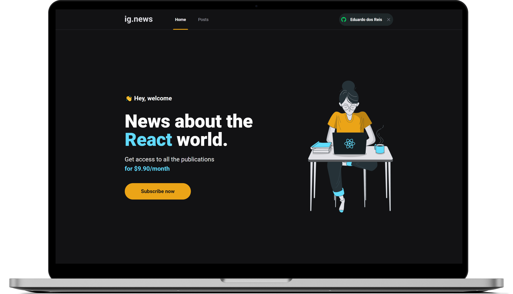
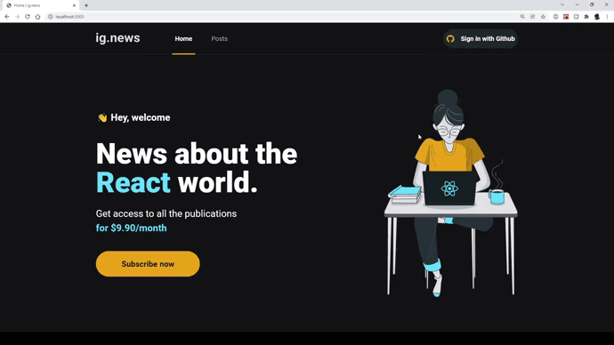

<h1 align="center">
  <a href="https://ignews-r9omlayqh-eduardoreisux.vercel.app" target="_blank" title="Visite o site">
    </img>
  </a>
</h1>

<p align="center">
  <a href="#ℹ-descrição">Descrição</a> •
  <a href="#-tecnologias">Tecnologias</a> •
  <a href="#-pré-requisitos">Pré-requisitos</a> •
  <a href="#-como-usar">Como usar</a> •
  <a href="#-demonstração">Demonstração</a>
</p>

<p align="center">
  </img>
  <a href="https://ignews-r9omlayqh-eduardoreisux.vercel.app" target="_blank">Visite o site</a>
</p>

## ℹ Descrição

Projeto desenvolvido ao longo do capítulo 3 do Ignite. 👨‍🚀🚀

Ignews é um blog de notícias sobre o ecossistema React. O projeto, feito com base na JAMStack, conta com diversas funcionalidades e integrações, através de várias APIs, como:

- Na página Home:
  - Acessar preview de posts, conteúdo completo será exibido apenas quando o usuário estiver inscrito no plano pago;
  - Login usando o Github através do _NextAuth.js_;
  - Inscrever-se no plano pago através do checkout com _Stripe_ e sincronizando o status no banco de dados do _FaunaDB_.
- Na página Post:
  - Listagem de todos os posts através do _Prismic CMS_;
  - Se o usuário não está inscrito, ao clicar num post, o usuário será redirecionado para Home;
  - Se o usuário está inscrito, acesso completo ao conteúdo do post pelo seu ID.
- Na página Post/[id]:
  - O usuário pode ler todo o conteúdo caso esteja inscrito.
    Entre outros…

## ⚒ Tecnologias

- [**React**](https://pt-br.reactjs.org)
- [**Typescript**](https://www.typescriptlang.org)
- [**Next.js**](https://nextjs.org)
- [**SCSS**](https://sass-lang.com/)
- [**React-Icons**](https://react-icons.github.io/react-icons/)
- [**Axios**](https://axios-http.com/)
- [**NextAuth.js**](https://next-auth.js.org/)
- [**FaunaDB**](https://fauna.com/)
- [**Stripe**](https://stripe.com/en-br)
- [**Prismic CMS**](https://prismic.io/)

## ⚙ Pré-requisitos

- [Git](https://git-scm.com)
- [Yarn](https://yarnpkg.com)
- Cadastro no [FaunaDB](https://fauna.com/)
- Cadastro no [Stripe](https://stripe.com/en-br)
- Cadastro no [Prismic CMS](https://prismic.io/)
- Editor de código.

## 🖥 Como usar

1. **Clone o projeto e acesse a pasta**

```bash
$ git clone https://github.com/EduardoReisUX/world-trip.git && cd world-trip
```

2. **Siga os passos seguintes**

```bash
# Instale as dependências
$ yarn

# Crie um arquivo ".env.local" que será a cópia de
# ".env.example" e atribua as variáveis de ambiente
$ cp .env.example .env

# Rode a aplicação
$ yarn dev
```

3. **Faça login com a conta do Github clicando em "Sign in with Github"**

4. **Inscreva-se clicando em "Subscribe now"**

5. **Na tela de pagamento, coloque esses dados**

- Número do cartão: 4242 4242 4242 4242
- CEP: 01001-000
- Preencha o restante das informações com dados fictícios.

6. **Pronto, acesse o conteúdo completo dos posts.**

## 👀 Demonstração

<p align="center">
</img>
</p>

---

<p align="center">Feito com 💜 por <a href="https://github.com/EduardoReisUX">Eduardo dos Reis</a></p>
<p align="center">Deployed by ▲ Vercel</p>
